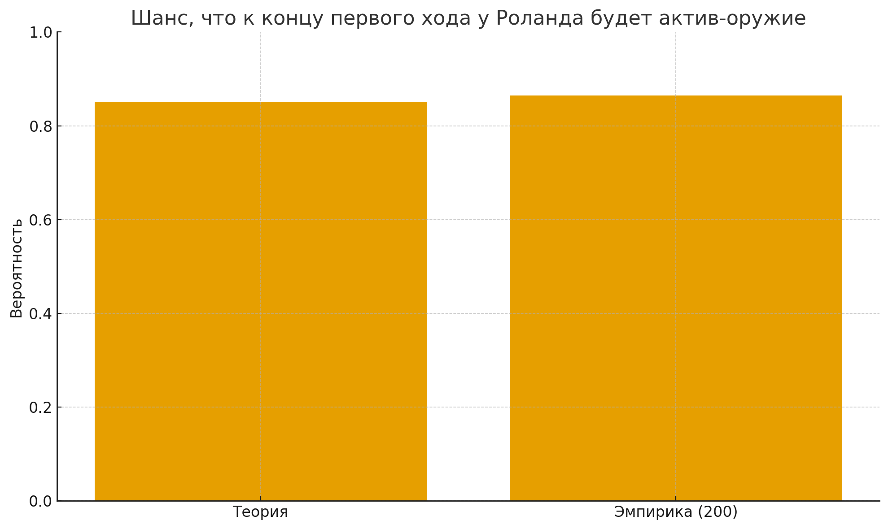

# Arkham_prob_lab

## Описание проекта

**«Классическое определение вероятности»**

### Цель работы
Сравнить вероятности событий, вычисленные с использованием формул и теорем классической вероятности, и частоты появления событий, проведя серию испытаний.

### Задачи
1. Вычислить вероятности событий, используя формулы классической вероятности и полной вероятности, теоремы сложения и умножения вероятностей.
2. Смоделировать серию испытаний (200 испытаний) согласно условию задания.
3. Подсчитать частоту появления события.
4. Сравнить теоретические и эмпирические результаты.

### Задача
Начинается прохождение сценария в игре «Ужас Аркхэма. Карточная игра». Один из игроков взял стартовую колоду Роланда Бэнкса, планируя в сценарии быть бойцом.

**Какова вероятность, что к концу хода у этого игрока в его игровой зоне будет лежать актив-оружие?**

#### Условия:
- Игрок во время набора стартовой руки стремится найти хотя бы один актив-оружие.
- Игрок не будет заменять карту «Патрульный», если она придёт ему во время набора стартовой руки.

### Ссылки
- [Правила «Ужаса Аркхэма»](AHC01_Learn_to_Play_RU_2020_1.pdf)
- [Справочник «Ужаса Аркхэма»](AHC01_Rules_Reference_RU_2020_1.pdf)

---

## Результаты исследования

### Теоретическая вероятность
При описанной стратегии (оптимальный муллиган, «Патрульного» не сбрасываем):

**Pr(оружие в игре к концу 1-го хода) = 73493/86304 ≈ 0.8516 (85.16%)**

### Модель и обозначения
- Полный размер колоды перед началом игры: **N = 33** (30 обычных + 2 персональные + 1 базовая слабость)
- Размер стартовой руки: **H = 5**
- Число активов-оружий в колоде: **W = 5** (Револьвер Роланда, Пистолет .45, Мачете, 2×Нож)
- Карта «Патрульный» в единственном экземпляре: **P = 1**
- Прочих карт: **N_other = N - W - P = 27**

### Эмпирические результаты (200 испытаний)
- Полученная частота: **ˆp = 173/200 = 0.865 (86.5%)**
- 95% доверительный интервал: **[0.818; 0.912]** (нормальное приближение)
- 95% доверительный интервал Уилсона: **[0.811; 0.906]**

**Вывод:** Теоретическое значение (85.16%) попадает в оба 95% доверительных интервала эмпирической частоты, что подтверждает корректность теоретической модели. Небольшое превышение эмпирической частоты над теоретической объясняется обычной выборочной флуктуацией.

### Таблица результатов



### Использованные методы теории вероятностей
- **Классическая модель**: равновозможные сочетания без возвращения ⇒ биномиальные коэффициенты C(n, k)
- **Гипергеометрическое распределение** для вычисления вероятности «ни одного успеха в r вытяжках»
- **Теорема умножения** и **закон полной вероятности** для суммирования вкладов по разбиению (A, B)
- **Оценка доли** ˆp = k/n, стандартная ошибка, нормальный и уилсоновский доверительные интервалы

---

## Код симуляции

Реализация симуляции на Python:

```python
from math import comb
import random

N_total = 33  # 30 обычных + 2 персональные + 1 базовая слабость
W = 5         # число активов-оружия в колоде Роланда
P = 1         # «Патрульный» (ally), не сбрасываем при муллигане
H = 5         # стартовая рука

def hypergeom_no_success(N, K, n):
    """Вероятность не получить ни одного успеха в n вытяжках"""
    return comb(N-K, n) / comb(N, n)

# Теоретические вычисления
N_other = N_total - W - P
p_k0_b0 = comb(W, 0) * comb(P, 0) * comb(N_other, H) / comb(N_total, H)
p_k0_b1 = comb(W, 0) * comb(P, 1) * comb(N_other, H - 1) / comb(N_total, H)

p_fail_r5 = hypergeom_no_success(N_total - H, W, 5)
p_fail_r4 = hypergeom_no_success(N_total - H, W, 4)

p_theory_success = 1 - (p_k0_b0 * p_fail_r5 + p_k0_b1 * p_fail_r4)

# Эмпирическая симуляция
def simulate_one_trial(seed=None):
    """Симуляция одного испытания с муллиганом"""
    rng = random.Random(seed)
    deck = ['W'] * W + ['B'] * P + ['O'] * (N_total - W - P)
    rng.shuffle(deck)
    hand = deck[:H]
    rest = deck[H:]
    keep = [c for c in hand if c in ('W', 'B')]
    replace = [c for c in hand if c == 'O']
    draw_n = len(replace)
    drawn = rest[:draw_n]
    final_hand = keep + drawn
    return any(c == 'W' for c in final_hand)

def run_simulation(n_trials=200, seed=7):
    """Запуск серии испытаний"""
    rng = random.Random(seed)
    return sum(simulate_one_trial(seed=rng.randrange(1<<30)) for _ in range(n_trials)) / n_trials

if __name__ == "__main__":
    print("p_theory_success =", p_theory_success)
    print("empirical (200)  =", run_simulation(200))
```

### Запуск симуляции

```bash
python3 arkham_prob_lab1.py
```

Ожидаемый вывод:
```
p_theory_success = 0.8515596032628847
empirical (200)  = 0.865
```

---

## Файлы репозитория

- `arkham_prob_lab1.py` - основной скрипт с теоретическими расчётами и симуляцией
- `report.pdf` - полный отчёт о проведённом исследовании (7 страниц)
- `table.png` - таблица с результатами вычислений
- `AHC01_Learn_to_Play_RU_2020_1.pdf` - правила игры «Ужас Аркхэма»
- `AHC01_Rules_Reference_RU_2020_1.pdf` - справочник по игре «Ужас Аркхэма»